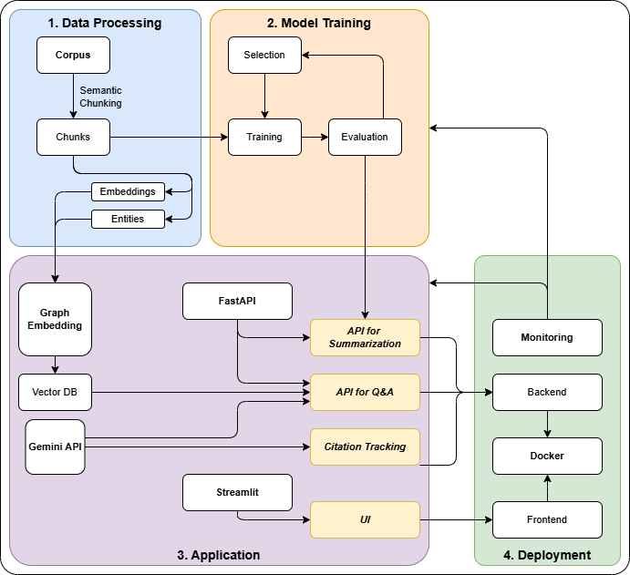
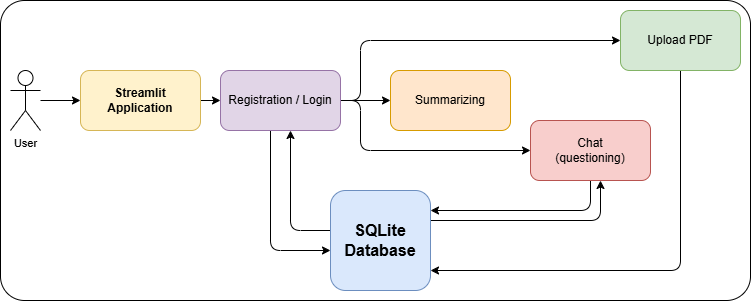
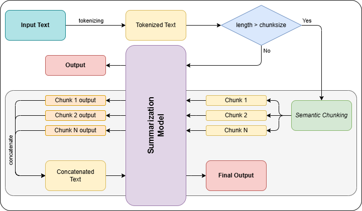
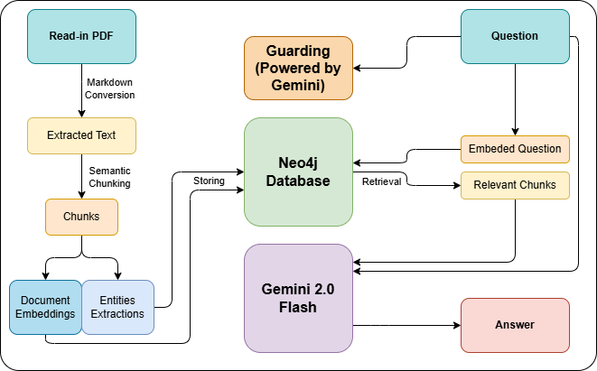

# Academic Paper SummarAIzer

An end-to-end AI-powered application for uploading, processing, summarizing, and querying academic PDFs. Built with state-of-the-art NLP models, modern UI frameworks, and production-ready deployment tools.


## Key Features
- **PDF Ingestion & Parsing**: Upload academic papers (PDF), extract structured text and metadata.
- **Citation Extraction**: Automatically detect and format bibliographic references using NLP.
- **Summarization**: Generate abstractive summaries via transformer-based models like LED and LongT5.
- **Natural-Language Q&A**: Ask detailed questions about paper content with accurate, contextual answers.
- **Citation Tracking**: Track citation networks with graph embeddings and Neo4j.
- **Monitoring & Observability**: Prometheus-powered service health and performance tracking.
- **Streamlit Frontend**: Lightweight, intuitive UI for document interaction and querying.
- **Dockerized Deployment**: Backend, frontend, and database services managed via Docker Compose.

## LLMOps Lifecycle and Architecture
A high-level view of your LLM system lifecycle, from data ingestion and training to real-time inference and monitoring.

<div align="center" style="text-align: center;">
    
    <div style="font-style: italic;">Figure 1: A high-level lifecycle view of deploying LLM-based applications—from data acquisition to continuous evaluation and monitoring.</div>
</div>
<br>

Application architecture follows a modular design that includes:
- **Data Processing** – Semantic chunking, embedding, entity extraction.
- **Model Training** – Fine-tuning transformer models with document-level datasets.
- **Application Layer** – APIs for summarization, Q&A, and citation management via FastAPI and Gemini.
- **Deployment** – Dockerized microservices with integrated frontend, backend, and monitoring.


## Component Interaction
**User Flow**  
Users interact with the platform through the Streamlit-based frontend, uploading PDFs, registering/logging in, and receiving summarized output and Q&A support.

<div align="center" style="text-align: center;">
    
    <div style="font-style: italic;">Figure 2: A snapshot of the frontend application showing how users can upload documents, view results, and interact with the system.</div>
</div>
<br>

**Summarization Flow**  
Once a user uploads a paper, the system splits the content into manageable chunks (up to 8K tokens each), processes them through a fine-tuned LED or LongT5 model, and generates concise, coherent summaries. The final summary may be hierarchical — combining chunk-level summaries into a high-level overview.
<div align="center" style="text-align: center;">
    
    <div style="font-style: italic;">Figure 3: A summary visualization generated by the model, showing how it condenses full-length papers into brief, structured outputs.</div>
</div>
<br>


**Q&A Interface**  
Ask natural-language questions about uploaded papers. Relevant chunks are retrieved using embeddings and graph search from a Neo4j database, then processed by Gemini.

<div align="center" style="text-align: center;">
    
    <div style="font-style: italic;">Figure 4: Demonstrates the Q&A interface where input natural language questions and receive context-aware answers from the document.</div>
</div>
<br>


## Quickstart
**1. Clone the repository**  
```bash
git clone https://github.com/Gitnut11/Academic-Paper-SummarAIzer.git
cd Academic-Paper-SummarAIzer
```

**2. Configure environment**  
Create a `.env` file with the following:
```ini
NEO4J_URI="bolt://neo4j:7687" # Use this for using locally, or your provided URI
NEO4J_USERNAME="neo4j"
NEO4J_PASSWORD="your-password"

GEMINI_API_KEY="your-gemini-api-key"
```

Sign up for free:
- [Neo4j Aura](https://neo4j.com/)
- [Google Gemini API](https://aistudio.google.com/)


**3. Launch Services with Docker**  
```bash
docker-compose up --build
```

Services will be accessible at:
- Backend: http://localhost:8000
- Frontend: http://localhost:8501
- Neo4j Browser: http://localhost:7474
- Prometheus Dashboard: http://localhost:9090


## Project Structure
```bash
Academic-Paper-SummarAIzer/
│
├── src/
│   ├── backend/
│   │   ├── main.py                 # FastAPI entrypoint
│   │   ├── Dockerfile              # Dockerfile to define the backend
│   │   ├── models/
│   │   │   ├── get_citation.py     # Citation extraction logic
│   │   │   ├── summarize.py        # Summarization endpoint
│   │   │   └── qna.py              # Q&A endpoint with Gemini
│   │   ├── sqlite_db/
│   │   │   ├── database.py         # SQLite setup
│   │   │   └── db_functions.py     # Function calls with DB interaction
│   │   └── utils/
│   │       ├── config.py           # Environment and Logging config
│   │       ├── pdf_utils.py        # PDF text extraction
│   │       ├── prompt.py           # Prompt templates
│   │       └── safety_check.py     # Input validation
│   │
│   └── frontend/
│       ├── main.py                 # Streamlit UI
│       ├── tos.py                  # Terms of Service display
│       └── Dockerfile              # Dockerfile to define the frontend
│
├── models/                         # Models training and evaluating
│   ├── train/
│   │   ├── led_train.ipynb
│   │   └── longt5_train.ipynb
│   └── evaluate/
│       ├── led_eval.ipynb
│       ├── longt5_eval.ipynb
│       └── qna_eval.ipynb
│
├── docker-compose.yml              # Container setup for all services
├── prometheus.yml                  # Prometheus setings
└── .env.example                    # Environment variables, need to be renamed to `.env` later
```

## Model Evaluations
Our models were evaluated on two benchmark datasets:
- **Summarization**: ScisummNet dataset.
- **Q&A**: QuAC (Question Answering in Context) dataset.

We used the following metrics for evaluation:
- **ROUGE**
- **BERTScore**
- **BLEURT**
- **METEOR**

For detailed metric scores and analysis, please refer to the [project report](docs/report.pdf).

## Future Work
- **Enhancing Model Performance:** Improve the robustness and generalization of the summarization and Q&A models by fine-tuning on a larger and more diverse scientific dataset and exploring more advanced language model architectures.

- **Scaling LLMOps Infrastructure:** Evolve the system’s LLMOps maturity by introducing automated pipelines for continuous integration, deployment, and training, while leveraging user feedback to refine models through techniques like reinforcement learning.

- **Expanding Functionality:** Broaden document input support beyond PDFs and introduce intelligent features like multi-document summarization and conflict detection, while leveraging graph databases like Neo4j for deeper document insights.

- **Improving Evaluation Practices:** Complement automated metrics with structured human evaluations and consider creating new metrics tailored to scientific understanding.

- **Strengthening Safety and Ethics:** Enhance prompt filtering and safety mechanisms to reduce bias, hallucinations, and ensure better handling of sensitive information.

## Contributors
We thank all individuals who have contributed to this project:
- [Gitnut11](https://github.com/Gitnut11)
- [Kiet-2004](https://github.com/Kiet-2004)
- [Melios22](https://github.com/Melios22)
- [Namronaldo08102004](https://github.com/Namronaldo08102004)

This project was part of NLP Application course, developed during Apr 2025 - May 2025.

## Final Words & Acknowledgements
This project is a culmination of our efforts to make academic literature more accessible through intelligent summarization and contextual understanding. We learned a great deal about working with large language models, scalable systems, and human-centric evaluation along the way.

Special thanks to:
- Our mentors and instructors, for their continuous guidance and feedback.
- The open-source community, especially Hugging Face, PyTorch, and Streamlit, for enabling rapid prototyping and experimentation.
- Our peers, who helped test, review, and refine our application.

We hope this tool contributes meaningfully to the future of accessible, AI-assisted academic research.


